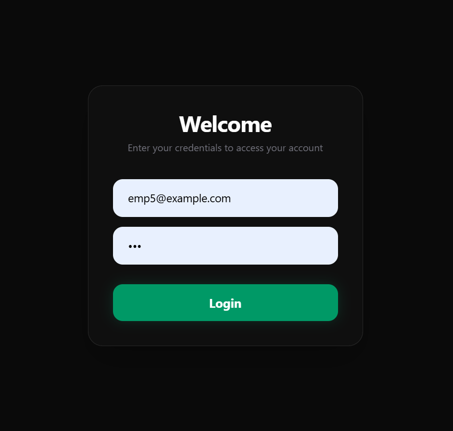
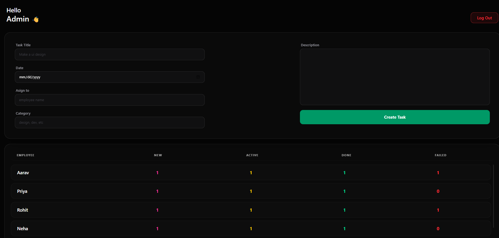
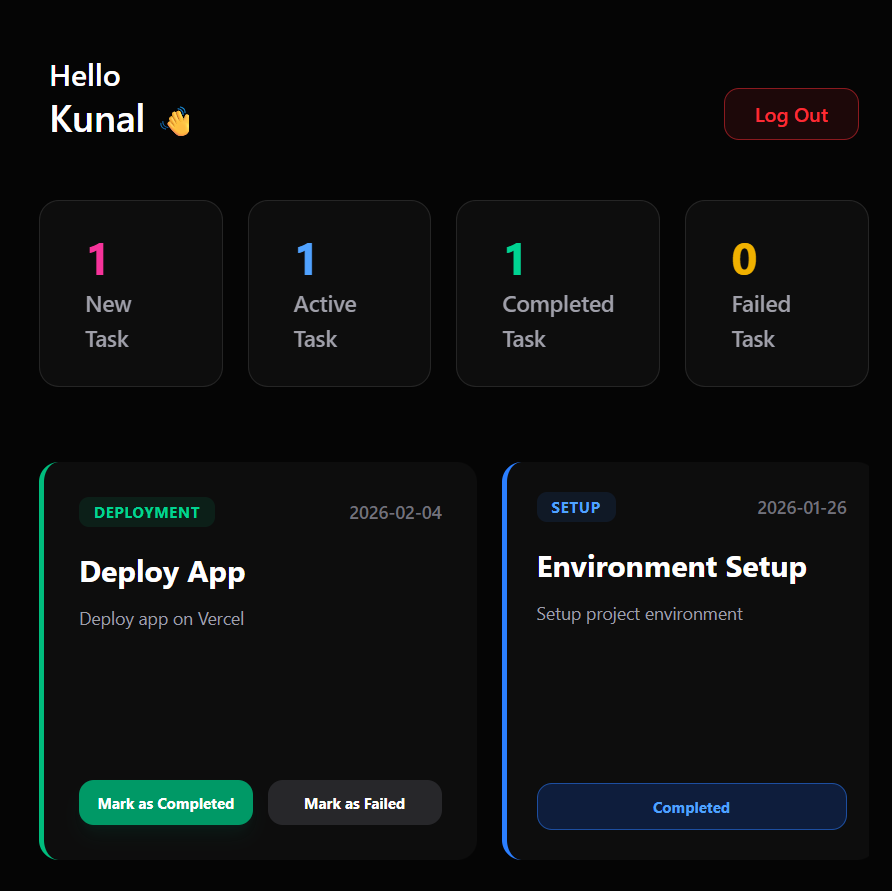

# Employee Management System 

A modern, interactive, and responsive Task Management System built using **React.js** and **Tailwind CSS**. This project features a sleek "Dark Mode" aesthetic with glassmorphism effects and smooth animations using **Framer Motion**.

##  UI/UX Features
- **Glassmorphism Design:** Translucent backgrounds with frosted-glass effects.
- **Interactive Animations:** Micro-interactions on buttons and smooth entrance animations for cards.
- **Responsive Layout:** Fully optimized for desktops and tablets.
- **Dynamic Headers:** Personalized greetings for logged-in users.

##  Tech Stack
- **Frontend:** React.js
- **Styling:** Tailwind CSS
- **State Management:** React Context API (AuthContext)
- **Persistence:** LocalStorage API
- **Animations:** Framer Motion & Lucide Icons

##  Demo Credentials
Since this project uses `localStorage` for data persistence, use the following accounts to test the different dashboards:

### Admin Portal
- **Email:** `admin@example.com`
- **Password:** `123`

### Employee Portal
- **Email:** `emp1@example.com`
- **Password:** `123`
*(Other employees: `emp2@example.com`, `emp3@example.com`, etc., all with password `123`)*

## 🚀 How it Works
1. **Authentication:** The app checks the `localStorage` for existing user data upon launch.
2. **Admin Dashboard:** Admins can create tasks, assign them to specific employees, and see a real-time summary of all task statuses (New, Active, Completed, Failed).
3. **Employee Dashboard:** Employees view their specific tasks in a horizontally scrollable list and can update their status.
4. **Data Persistence:** All task updates and creations are saved to the browser's `localStorage`, ensuring data remains even after a page refresh.

##  Installation & Setup
1. Clone the repository:
   ```bash
   git clone https://github.com/apurvasankhe1338/employee-management-system-react.git
2. Install dependencies:
   ```bash
   npm install framer-motion lucide-react
3. Start the development server:
   ```bash
   npm run dev
##  Project Structure
```bash
The application is organized into modular components for scalability:
src/
├── context/
│   └── AuthProvider.jsx
│       # Manages global authentication state and syncs data with localStorage
│
├── utils/
│   └── localStorage.jsx
│       # Handles setting and retrieving employees and admin data from browser localStorage
│
├── components/
│   ├── Auth/
│   │   └── Login.jsx
│   │       # Entry portal with interactive validation and glassmorphism UI
│   │
│   ├── Dashboard/
│   │   ├── AdminDashboard.jsx
│   │   │   # Administrative control center for task delegation and monitoring
│   │   └── EmployeeDashboard.jsx
│   │       # Personalized dashboard for employees to track assigned work
│   │
│   ├── others/
│   │   ├── Header.jsx
│   │   │   # Dynamic user greeting and secure logout functionality
│   │   ├── CreateTask.jsx
│   │   │   # Admin form to create and assign new tasks
│   │   ├── AllTask.jsx
│   │   │   # Summary table to track team-wide task performance
│   │   └── TaskListNumber.jsx
│   │       # High-level overview of task counts by status
│   │
│   └── TaskList/
│       ├── TaskList.jsx
│       │   # Scrollable container rendering task cards
│       ├── AcceptTask.jsx
│       ├── NewTask.jsx
│       ├── CompleteTask.jsx
│       └── FailedTask.jsx
│           # Modular components representing task states
```

## 📸 Screenshots

### 🔐 Login Page


### 🧑‍💼 Admin Dashboard


### 👨‍💻 Employee Dashboard


✨ Clerk authentication and deployment will be added in future updates.


